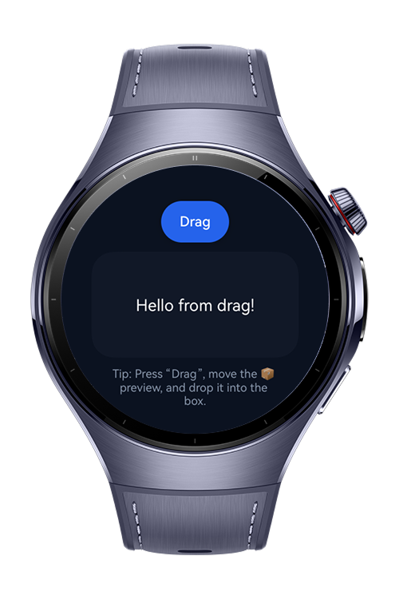

> **Note:** To access all shared projects, get information about environment setup, and view other guides, please visit [Explore-In-HMOS-Wearable Index](https://github.com/Explore-In-HMOS-Wearable/hmos-index).

# How To Use Drag And Drop

This codelab demonstrates how to implement a basic **drag-and-drop interaction** in a HarmonyOS application using `@ohos.arkui.dragController`.


# Preview

<div>    
  
  
</div>

# Use Cases

- **Wearable-friendly UI**: Designed to fit a watch-sized circular display, ensuring all components (drag source and drop target) are visible and usable.
- **Drag initiation**: Tapping the **Drag** button triggers a drag action with a preview showing 📦 and the text *“Hello from drag!”*.
- **Drop target**: A dark rectangular box accepts the drop. On `onDrop`, the box updates its text with the dropped value.
- **Visual feedback**:
    - The drop zone slightly scales up and changes its border color on `onDragEnter`.
    - The preview foreground animates to green for extra confirmation.
- **Learning outcome**: Teaches how to use `DragController.executeDrag`, handle `onDragEnter/onDrop`, and customize drag previews for HarmonyOS apps.


# Tech Stack

- **Languages**: ArkTS, ArkUI
- **Frameworks**: HarmonyOS SDK 5.0.2(14)
- **Tools**: DevEco Studio Vers 5.1.0.828
- **Libraries**: @kit.ArkUI, @kit.ArkData, @kit.PerformanceAnalysisKit, @kit.BasicServicesKit


# Directory Structure

```
│   module.json5
│
├───ets
│   ├───entryability
│   │       EntryAbility.ets
│   │
│   ├───entrybackupability
│   │       EntryBackupAbility.ets
│   │
│   └───pages
│           Index.ets
│
└───resources
    ├───base
    │   ├───element
    │   │       color.json
    │   │       float.json
    │   │       string.json
    │   │
    │   ├───media
    │   │       background.png
    │   │       foreground.png
    │   │       layered_image.json
    │   │       startIcon.png
    │   │
    │   └───profile
    │           backup_config.json
    │           main_pages.json
    │
    ├───dark
    │   └───element
    │           color.json
    │
    └───rawfile

```

# Constraints and Restrictions

## Supported Device

* Huawei Watch 5

# License

**Drag And Drop Codelab** is distributed under the terms of the MIT License
See the [LICENSE](./LICENSE) for more information.